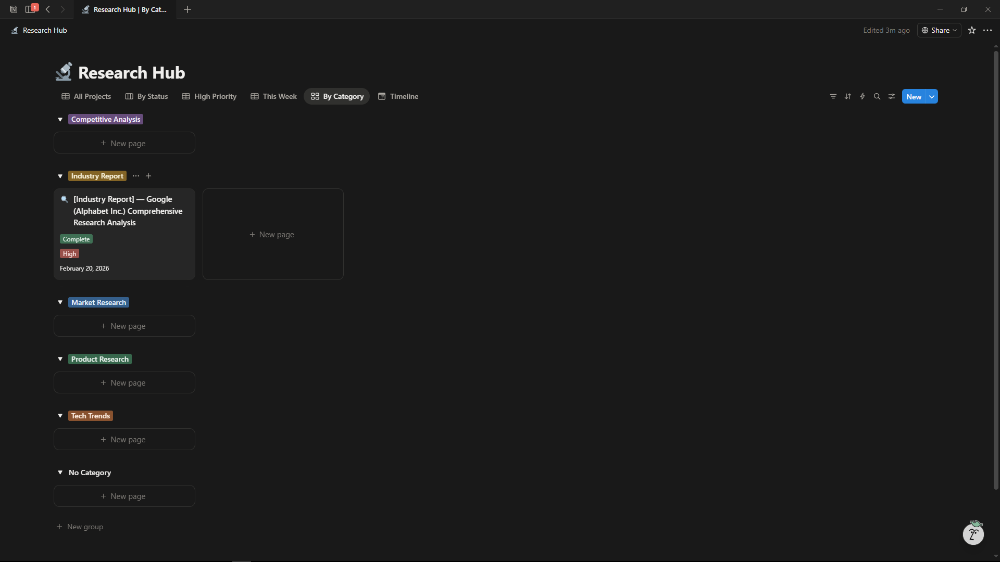

# Research Automation System

**Built by:** Thalari Koushik  
**Role:** Project Coordinator | Research Operations  
**Status:** ✅ Active / Fully Operational

---

## 🎯 Problem Statement

Manual research processes were creating business bottlenecks:
- **CEO Pain Point:** 3-5 days to gather market intelligence — competitors move faster
- **Operations Pain Point:** Research scattered across emails, drives, and bookmarks — no single source of truth
- **Cost Impact:** Teams spending 10+ hours/week on manual data collection at ₹6-8L annual cost per person

**Core Issue:** Research was people-dependent, not process-driven.

---

## 💡 Solution

Built a **no-code Research Operations workflow** using AI-assisted tools and structured documentation systems.

### Key Components:

| Component | Tool Used | Purpose |
|-----------|-----------|---------|
| **Knowledge Base** | Notion | Centralized research database with relational properties |
| **AI Research Engine** | Perplexity Pro + ChatGPT | Automated data gathering and summarization |
| **Tracking System** | Google Sheets | Research project tracking and time measurement |
| **Output Templates** | Canva + PowerPoint | Standardized client-ready report formats |

---

## 🛠️ System Architecture

### 1. Research Hub (Notion Database)
- **Properties:** Topic | Category | Status | AI Summary | Source URL | Tags | Date
- **Views:** By Category | By Status | By Date (Timeline)
- **Templates:** Pre-formatted research report structure

### 2. AI Prompt Library
Standardized prompts for consistent outputs:

**Quick Market Scan:**
> Give me a 300-word summary of [TOPIC]. Include: key players, recent trends, market size. Bullet points. Cite sources. Max 1 page.

**Competitor Deep Dive:**
> Analyze [COMPANY]: 1) Business model 2) Top 3 features 3) Pricing 4) Recent news 5) Customer complaints. Table format.

**Trend Analysis:**
> Top 3 trends in [INDUSTRY] 2025. For each: What changed? Why it matters? Who's affected? 1 paragraph each.

**Document Polish:**
> Convert these notes into professional research format: [PASTE] Sections: Executive Summary, Key Findings, Sources, Next Steps.

### 3. Output Standardization
- One-page executive summaries
- Consistent formatting across all research reports
- Source citation protocols

---

## 📊 Results & Impact

| Metric | Before | After | Improvement |
|--------|--------|-------|-------------|
| **Research Time** | 3-5 days | 4 hours | **80% reduction** |
| **Output Consistency** | Variable formats | Standardized templates | **100% uniform** |
| **Knowledge Retention** | Lost when staff leaves | Centralized database | **Permanent** |
| **Onboarding Time** | 3 days training | 30 minutes | **93% faster** |

---

## 📁 Repository Contents

- `README.md` — This documentation
- `prompts/` — Detailed prompt engineering guides
- `automation/` — Workflow diagrams and SOPs
- `tools/` — Configuration guides for Notion, Perplexity, etc.
- `screenshots/` — System interface screenshots
- `templates/` — Notion template exports and prompt library
- `sample-outputs/` — Example research reports generated by this system

---

## 🚀 How to Use This System

1. **Create Research Request** in Notion database
2. **Run AI Prompt** (Perplexity/ChatGPT) with topic parameters
3. **Save Output** to Notion with source links and tags
4. **Format** using standardized template
5. **Deliver** client-ready report

---

## 🧰 Tools & Technologies

- **Notion** — Database and documentation
- **Perplexity AI** — Research and summarization
- **ChatGPT** — Content refinement
- **Google Sheets** — Project tracking
- **Canva** — Report visualization
- **PowerPoint** — Presentation formatting

---

## 📸 System Screenshots

### Research Hub (Notion Database)

### AI Prompt Library

### Sample Research Output

---

## 📄 Sample Deliverable

[View Sample Research Report: AI Project Management Tools 2025](sample-outputs/AI-Project-Management-Tools-2025.md)

---

## 📞 Contact

**Thalari Koushik**  
📧 [Your Email]  
🔗 [LinkedIn Profile]  
📍 Allagadda, Andhra Pradesh | Bengaluru

---

*Built for non-technical research operations. No coding required.*
